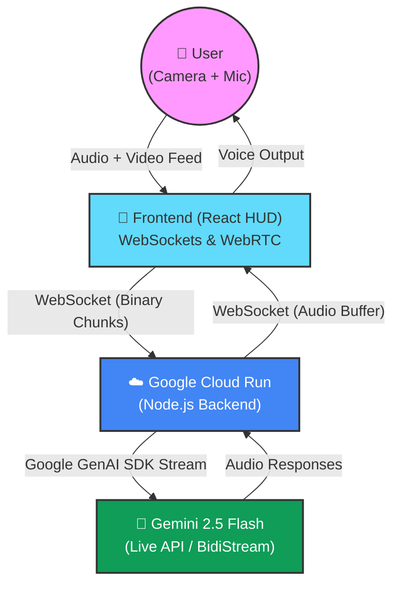

# 🛠️ FixMate 

**Winner Contender for the Gemini Live Agent Challenge**
**Category:** Live Agents 🗣️ (Real-time Interaction - Audio/Vision)

> *FixMate is a real-time, interruptible, hands-free hardware repair and installation AI assistant that sees what you see and talks you through complex physical tasks.*

---

## 💡 The Vision

"FixMate" empowers everyone—from hobbyists building PCs to elderly folks fixing household appliances—with contextual, visual intelligence. It breaks the "text box" paradigm completely. 

While designed today as a progressive web app accessible via smartphone or laptop cameras, its architecture is decoupled and lightweight. It acts as the foundational AI layer for tomorrow's AR wearables (like Meta Ray-Ban, Apple Vision Pro, or affordable smart glasses). 

When your hands are full holding a screwdriver and a motherboard, you can't type. **FixMate watches, listens, and guides.**

## ✨ Features

- **👀 Multimodal Vision:** Streams video frames directly to Gemini 2.5 Flash BidiStream. FixMate understands exactly what you are pointing at.
- **🗣️ Natural Voice Conversation:** Powered by the new Gemini Live API. It speaks back to you naturally.
- **✋ Graceful Interruptions:** Just like a real human assistant, if FixMate tells you to "cut the red wire" but you say "Wait, I only see blue and green!", it will instantly stop talking and re-evaluate the visual context.
- **☁️ Cloud-Native Backend:** Deployed flawlessly on Google Cloud Run for zero-latency streaming.
- **📱 Simulated Camera Fallback:** A beautiful cyberpunk-themed HUD grid fallback for devices without camera access, ensuring the UI can always be tested.

---

## 🏗️ Architecture Diagram

Below is the seamless real-time flow between the Client (Frontend) and the Brain (Google Cloud Backend).



---

## 🚀 Spin-Up Instructions (For Judges & Developers)

We built this project to be deeply reproducible. The backend utilizes **Infrastructure-as-Code (Terraform & gcloud)** to ensure anyone can spin it up on Google Cloud within minutes.

### 1. Prerequisites
- [Node.js](https://nodejs.org/) (v20+)
- [Google Cloud CLI (`gcloud`)](https://cloud.google.com/sdk/docs/install)
- A Google Cloud Project with Billing Enabled.
- A **Gemini API Key** from [Google AI Studio](https://aistudio.google.com/).

### 2. Running Locally (Development Mode)

**Terminal 1 (Backend):**
```bash
cd backend
npm install
# Create a .env file and add your GEMINI_API_KEY
echo "GEMINI_API_KEY=your_api_key_here" > .env
npm run start
```
*The backend will start a WebSocket server on `ws://localhost:8080`*

**Terminal 2 (Frontend):**
```bash
cd frontend
npm install
# In browser, the app will ask for Mic/Camera permissions
npm run dev
```

### 3. Deploying to Google Cloud Run (Production)

We have automated the deployment pipeline using Google Cloud Build. This means **no local Docker installation is required!**

1. Authenticate your gcloud CLI: `gcloud auth login`
2. Set your Google Cloud Project: `gcloud config set project YOUR_PROJECT_ID`
3. Add your Gemini API Key to `backend/.env` just like the local steps.
4. Run the deployment script:

```bash
cd backend
chmod +x deploy.sh
./deploy.sh
```

The script will containerize the backend, push it to the Google Cloud Container Registry, and deploy it to a public Google Cloud Run URL. *Note: Update `frontend/src/App.tsx` (Line 38) with your newly generated Cloud Run WebSocket URL.*

---

## 🛠️ Built With

- **Google GenAI SDK:** Live API (Gemini 2.5 Flash)
- **Google Cloud:** Cloud Run, Cloud Build, Container Registry, Cloud Storage
- **Frontend:** React, TypeScript, Vite, WebRTC, Vanilla CSS
- **Backend:** Node.js, Express, `ws` (WebSockets)
- **IaC:** Terraform (`main.tf`), Bash (`deploy.sh`)

---
*Created for the Gemini Live Agent Challenge (March 2025).*
